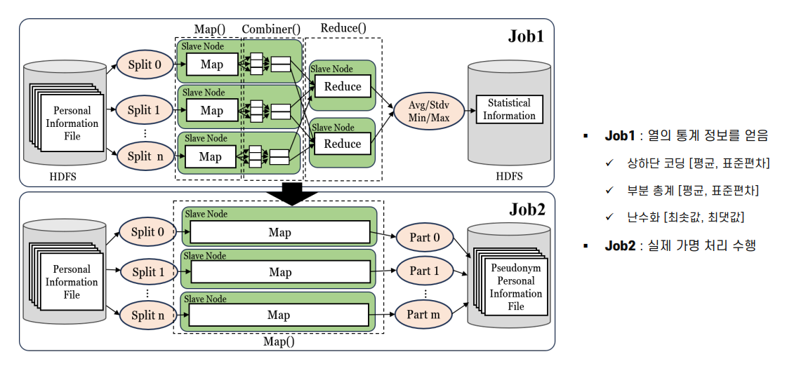

# 대용량 정형 데이터에 대한 MapReduce 기반 분삭 가명 처리 시스템 

## 프로젝트 개요

|||
|:---:|--|
|**과제명**|대용량 정형 데이터 대상 개인정보 가명,익명화를 위한 자동처리 기술|
|**지원 기관**|정보통신기획평가원 (IITP)|
|**프로젝트 기간**| 2023.03 - 2023.12 |
|**연구 목표**| 2TB 개인정보 파일을 4시간 내에 가명/익명처리 완료   * 기준: 16 노드 클러스터|

 
 

## 프로젝트 소개
- TB급 대용량 데이터에 대한 최초의 Hadoop MapReduce 기반 분산 가명처리 시스템 개발
- 총 8개의 대표적인 가명처리 기능 제공
  
|기능|설명|
|:---:|---|
|상하단코딩   (Top and Bottom Coding)|적은 수의 분포를 가진 양 끝단의 정보를 평균값으로 대체하여 식별성을 낮추는 기법|
|부분 총계   (Micro-Aggregation)|특정 그룹 내, 다른 정보에 비하여 오차 범위가 큰 항목을 평균값 등으로 대체|
|난수화   (Randomization)|주어진 입력 값에 대해 예측이 불가능하고 패턴이 없는 값으로 임의 할당|
|열 삭제   (Column Deletion)|개인정보 열 전체 삭제|
|마스킹   (Masking)|특정 항목의 일부 또는 전부를 공백 또는 문자로 대체|
|부분 삭제   (Partial Deletion)|개인정보 전체 삭제 대신 일부 삭제|
|라운딩   (Rounding)|올림, 내림, 반올림 등의 기준을 적용하여 집계 처리|
|암호화   (Encryption)|지정된 열을 SHA-256 알고리즘을 사용하여 암호화|

## 제안 시스템 전반적인 흐름도 
</img> 

