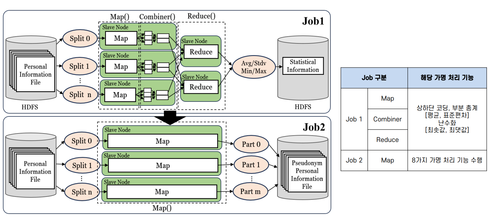
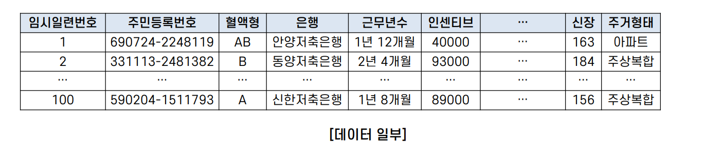

# 대용량 정형 데이터에 대한 MapReduce 기반 분삭 가명 처리 시스템 

## 프로젝트 개요

|||
|:---:|--|
|**과제명**|대용량 정형 데이터 대상 개인정보 가명,익명화를 위한 자동처리 기술|
|**지원 기관**|정보통신기획평가원 (IITP)|
|**프로젝트 기간**| 2023.03 - 2023.12 |
|**연구 목표**| 2TB 개인정보 파일을 4시간 내에 가명/익명처리 완료   * 기준: 16 노드 클러스터|

 
 
 

## 프로젝트 소개
- TB급 대용량 데이터에 대한 최초의 Hadoop MapReduce 기반 분산 가명처리 시스템 개발
- 총 8개의 대표적인 가명처리 기능 제공
  
|기능|설명|
|:---:|---|
|상하단코딩   (Top and Bottom Coding)|적은 수의 분포를 가진 양 끝단의 정보를 평균값으로 대체하여 식별성을 낮추는 기법|
|부분 총계   (Micro-Aggregation)|특정 그룹 내, 다른 정보에 비하여 오차 범위가 큰 항목을 평균값 등으로 대체|
|난수화   (Randomization)|주어진 입력 값에 대해 예측이 불가능하고 패턴이 없는 값으로 임의 할당|
|열 삭제   (Column Deletion)|개인정보 열 전체 삭제|
|마스킹   (Masking)|특정 항목의 일부 또는 전부를 공백 또는 문자로 대체|
|부분 삭제   (Partial Deletion)|개인정보 전체 삭제 대신 일부 삭제|
|라운딩   (Rounding)|올림, 내림, 반올림 등의 기준을 적용하여 집계 처리|
|암호화   (Encryption)|지정된 열을 SHA-256 알고리즘을 사용하여 암호화|

 
 
 

## 제안 시스템 전반적인 흐름도 
</img> 

- **Job1** : 가명화 연산 수행을 위해 통계 정보 획득 단계
  - Map, Combiner, Reduce 함수로 구성
  - 수행 기능 : 상하단 코딩, 부분 총계 [평균, 표준편차] / 난수화 [최솟값, 최댓값]
  - **Map()** : 입력 데이터에서 특정 조건에 맞는 데이터 필터링
  - **Combiner()** : Map의 출력을 합계, 제곱합, 개수, 최솟값, 최댓값 등으로 집계하여 전송
  - **Reduce()** : Combiner의 출력을 통해 열의 평균/표준편차, 최솟값/최댓값 계산
  
- **Job2** : 8가지 가명 처리를 실질적으로 수행하는 작업
  - 불필요한 Reduce 단계를 생략한 Map-Only 작업
  - **Map()** : 레코드 별로 한 줄씩 읽어 가명 처리에 해당하는 열일 경우 연산 수행
  - Map 함수의 결과값은 최종적으로 가명 처리가 완료된 데이터로 HDFS에 저장

 ## 실험 환경  
 
<table>
  <tr>
    <td rowspan="2">노드 수</td>
    <td>네임 노드 : 1대</td>
  </tr>
  <tr>
  <td>데이터 노드 : 15대</td>
  </tr>
  <tr>
    <td rowspan="3">노드 성능</td>
    <td>CPU : Intel(R) Xeon(R) Silver@2.10GHz</td>
  </tr>
  <tr>
    <td>Memory : 64GB</td>
  </tr>
  <tr>
    <td> SSD : 500GB </td>
  </tr>
  <tr>
    <td> 운영체제 </td>
    <td> Linux </td>
  </tr>
  <tr>
    <td> Hadoop </td>
    <td> Hadoop-3.3.5 </td>
  </tr>

</table>

 
 
 

## 실험 데이터
- (주)이지서티에서 제공한 주민등록번호, 성별, 혈액형, 주거래은행, 근무년수, 연봉 등으로 구성된 가상 개인 정보를 사용
- 수치형 8개, 문자형 22개로 총 30개의 열로 구성된 정형 데이터
- 500GB / 1000GB / 1500GB / 2000GB 대규모 데이터로 실험 진행
- 2000GB 기준 약 60억 행으로 구성  
</img> 

